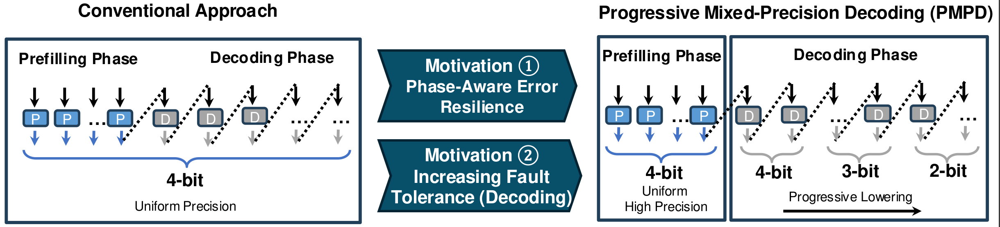
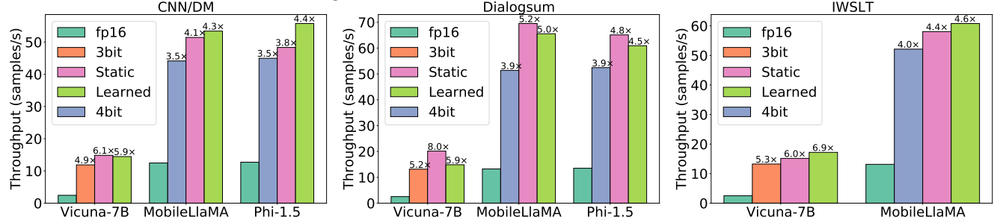

# Progressive Mixed-Precision Decoding for Efficient LLM Inference
[[paper](https://arxiv.org/abs/2410.13461)]

<div align="center">
  <picture>
      
  </picture>
  <br>
  <div align="left" width="100%">
  <em>Fig. 1: Conventional Quantized Decoding (left) vs Progressive Mixed-Precision Decoding (right). Our approach is motivated by i) the distinct error resilience observed during the prefill and decoding phases, and ii) the increasing fault tolerance as decoding progresses to later tokens in the generated sequence.</em>
  </div>
  <br>
</div>

**Progressive Mixed-Precision Decoding (PMPD)** is a novel method for optimizing large language model (LLM) execution by selectively adapting the precision of model weights during inference. Our approach consists of three key techniques:

- **Phase-Aware Precision Allocation**: Adapting precision levels to the distinct traits of each LLM inference phase, PMPD applies high precision in the prefill phase and reduced precision in the decoding phase, ensuring *i)* high-quality context understanding during prefill and *ii)* improved throughput during decoding.
- **Progressive Precision Reduction**: In the decoding phase, PMPD strategically reduces precision as the sequence of tokens is generated, optimizing hardware performance during the memory-bound decoding stage without sacrificing generation quality.
- **Flexible Precision-Switching Scheduling**: We provide two complementary schedulers: *i)* a *prompt-agnostic static scheduler* with uniform and task-optimized precision switching and *ii)* a *task-agnostic learned scheduler* with dynamic and prompt-specific precision switching. The two schedulers deliver separate trade-offs and each of them is more suitable for different settings, depending on the characterstics of the target application.

PMPD builds upon the observation that the prefill phase and the initial tokens of the decoding phase are more sensitive to approximations than later tokens. By employing quantization as our approximation mechanism, we selectively reduce arithmetic precision over the course of token generation, maximizing throughput while maintaining output quality. As such, our approach pushes the performance boundary of quantized models, with increased suitability for resource-constrained environments, such edge-based and mobile devices.

<div align="center">
  <picture>
  
  </picture>
  <br>
  <div align="center" width="100%">
  <em>Fig. 2: End-to-end NPU throughput. Speedup is obtained in comparison to the fp16 model. See Section 5 in the paper for details on the experimental setup.</em>
  </div>
  <br>
</div>


PMPD achieves **1.4x**-**12.2x speedup** for LLM linear layer computations on GPUs, and delivers **3.8x**–**8.0x throughput gains** on an LLM-optimized NPU, outperforming traditional uniform quantization methods while preserving output quality.


## Citation
Our paper is available [here](https://arxiv.org/abs/2410.13461). If you found PMPD helpful or relevant to your project and research, please kindly cite our paper:
```
@inproceedings{hao2025pmpd,
  title={{Progressive Mixed-Precision Decoding for Efficient LLM Inference}},
  author={Hao (Mark) Chen and Fuwen Tan and Alexandros Kouris and Royson Lee and Hongxiang Fan and Stylianos I. Venieris},
  booktitle={International Conference on Learning Representations (ICLR)},
  year={2025},
}

```

## Contents

- [Installation](#installation)
- [Quick Start](#quick-start)
  - [Basic API Usage](#basic-api-usage)
  - [End-to-End Example](#end-to-end-example)
- [Schedulers](#schedulers)
  - [Static Scheduler](#static-scheduler)
  - [Learned Scheduler](#learned-scheduler)
    - [Dataset](#dataset)
    - [Training](#training)
- [Evaluation](#evaluation)

## Installation

Prerequisites:

- Python 3.11
- CUDA Toolkit 12 or higher
- gcc-9 or higher


Install dependencies:

```pip install -r requirements```

Then install the package via

```pip install .```

For quantization method, [AnyPrecision](https://github.com/fwtan/any-precision-llm) and [AutoGPTQ](https://github.com/AutoGPTQ/AutoGPTQ) are used. Please see their installation guide for more details.

## Quick Start 

### Basic API Usage

Here is a minimal working example

```python
from pmpd import PMPDForCausalLM, Scheduler

model = PMPDForCausalLM(model_path, precisions=[4,3,2], use_anyprec=True).eval().cuda()
precisions = precisions
kw_dict = {}
kw_dict['precisions'] = [3,2]
# argument for naive scheduler
kw_dict['high_bit_steps'] = 10
# argument for kv_cache scheduler
kw_dict['precision_switch_points'] = precision_switch_points
kw_dict['save_dir'] = classifier_path
if use_anyprec:
    config = model.model.config
else:
    config = model.model.models[str(precisions[0])].config
kw_dict['dim'] = config.hidden_size // config.num_attention_heads
kw_dict['num_heads'] = config.num_key_value_heads
# initialize the scheduler
model.scheduler = Scheduler.get_scheduler('naive', **kw_dict)

outputs = model.generate(
                  input_ids=input_ids, 
                  max_new_tokens=max_steps, 
                  prefill_bit=prefill_bit, 
                  past_key_values=past_key_values)
```

The model path should point to the directory of the quantized model if using AnyPrecision or a json configuration file otherwise. 

If AnyPrecision format is not used, a separate model directory for each precision is needed. The json configuration file should look like this:

```json
{
  "2" : "gptq-Llama-2-7b-chat-hf-2bit", 
  "3" : "gptq-Llama-2-7b-chat-hf-3bit",
  "4" : "gptq-Llama-2-7b-chat-hf-4bit",
  "8" : "gptq-Llama-2-7b-chat-hf-8bit",
  "model_path" : "meta-llama/Llama-2-7b-chat-hf"
}
```

```gptq-Llama-2-7b-chat-hf-2bit``` is the folder where 2-bit model is saved, for instance.

### End-to-End Example

Here, we describe an end-to-end PMPD usage example using [AnyPrecision](https://github.com/SNU-ARC/any-precision-llm) as PTQ method and [MobileLlama-1.4B](https://huggingface.co/mtgv/MobileLLaMA-1.4B-Chat) as the base model. 

#### Prepare Quantized Model using AnyPrecision LLM

To quantize a model to any-precision, run [quantize.py](https://github.com/SNU-ARC/any-precision-llm/blob/main/quantize.py) with relevant arguments:

```bash
python quantize.py mtgv/MobileLLaMA-1.4B-Chat --seed_precision 3 --parent_precision 4
```

#### Train Learned Scheduler (Optional)

To train the Learned scheduler, follow the steps in the later [section](#learned-scheduler). 

#### Tune Static Scheduler on CNN/DM

To find the optimal number of high-precision model steps on CNN/DM validation dataset, run:

```bash
python3 pmpd/eval/eval.py \
    --model-id MobileLLaMA \
    --model-path anyprec-model-path \
    --bench-name cnn_dm \
    --precision-high 4 \
    --precision-low 3 \
    --steps 0,85,170 \
    --gpus 1,2,3 \
    --answer-file-dir data/anyprec/ \
    --static-search 
```

3 answer files are generated, for 0, 85, 170 high-precision steps respectively. The best high-precision step is picked based on custom criterion for performance. To evaluate the performance of each high-precision step, refer to this [section](#evaluation).

#### Evaluate on CNN/DM

The following command can be run to generate answer files on CNN/DM test dataset.

```bash
python3 pmpd/eval/eval.py \
    --model-id MobileLLaMA \
    --model-path anyprec-model-path \
    --fp-model mtgv/MobileLLaMA-1.4B-Chat \
    --bench-name cnn_dm \
    --precision-high 4 \
    --precision-low 3 \
    --answer-file-dir data/anyprec/ \
    --classifier-path learned-classifier-path \
    --high-bit-steps best-high-precision-step \
    --baseline \
    --kv-scheduler \
    --static-scheduler \
```

Replace ```best-high-precision-step``` with the optimal high-precision steps (an integer) found and ```learned-classifier-path``` with the directory path of the saved learned scheduler.

See [section](#evaluation) on how to evaluate the generated answer files.

## Schedulers

We currently support the following schedulers: 

### Static scheduler

This scheduler runs a high-precision model for a fiexed number of steps, then switch to a low-precision model. 

The scheduler can be created via

```python
kw_dict = {}
kw_dict['precisions'] = [3,2]
# argument for naive scheduler
kw_dict['high_bit_steps'] = 10
scheduler = Scheduler.get_scheduler('naive', **kw_dict)
```

### Learned Scheduler

This scheduler is a learned scheduler, which takes in KV cache to determine whether the precision should be lowered. 

This scheduler can be created via

```python
kw_dict = {}
kw_dict['precisions'] = [3,2]
# argument for kv_cache scheduler
kw_dict['precision_switch_points'] = precision_switch_points
kw_dict['save_dir'] = classifier_path
if use_anyprec:
    config = model.model.config
else:
    config = model.model.models[str(precisions[0])].config
kw_dict['dim'] = config.hidden_size // config.num_attention_heads
kw_dict['num_heads'] = config.num_key_value_heads
scheduler = Scheduler.get_scheduler('naive', **kw_dict)
```

```classifier_path``` points to the directory where the learned weights are saved.

#### Dataset

The training dataset is taken from the C4 dataset. To generate the scheduler training dataset, quantized models are needed. 

We first generate a tokenized dataset of a fixed length: 

```bash
python pmpd/train/generate_train_dataset.py --model-path lmsys/vicuna-7b-v1.5  --dir pmpd/train/data --size 256
```

Then, we use quantized models to generate labels

```bash
python pmpd/train/generate_train_dataset.py --second-stage --model-path anyprec-vicuna-7b-4-2  --dir pmpd/train/data --dataset pmpd/train/data/1st_stage_train_dataset_vicuna-7b-v1.5_256.pt  --size 256 --precisions 3,2 --use-anyprec
```

The generated second stage dataset can then be used for training. 

#### Training 

An example training script:

```bash
python pmpd/train/train_scheduler.py \
    --model_name_or_path meta-llama/Llama-2-7b-chat-hf \
    --data_path data_path.pt \
    --output_dir test \
    --num_train_epochs 30 \
    --gradient_accumulation_steps 32 \
    --learning_rate 0.0045 \
    --weight_decay 0.08031288528295362 \
    --precisions 4,3,2
```

An example hypertune script:

```bash
CUDA_VISIBLE_DEVICES=0 python pmpd/train/hypertune.py \
    --model_path mtgv/MobileLLaMA-1.4B-Chat \
    --data_path data_path.pt \
    -- precisions 4,3
```

## Evaluation

The script ```pmpd/eval/evaluate_generation.py``` can be used to run multiple evaluations.

```bash
python3 pmpd/eval/evaluate_generation.py --model-path gptq-vicuna-7b-config.json --model-id vicuna-7b --bench-name mt_bench --answer-file data/gptq/mt_bench/vicuna-7b-kv_cache-4-3-2.jsonl --scheduler kv_cache --classifier_path test_gptq-vicuna-7b-config.json_1024_1.1_lr_0.005/ --precisions 4,3,2 --use-multi-model
```

```--use-multi-model``` means AnyPrecision format is not used.

The generated answer files can then be evaluated via:

```bash
python3 pmpd/eval/get_score.py answer-files-path
```
